# 作业1
## 项目概述
本系统为设计师和开发者提供需求开发协作平台，主要功能包括：

1. 设计师可上传和预览设计稿

2. 开发者可将设计稿导出并转换为代码

3. 为不同角色提供专属视图

## 建模成果
### 用户故事
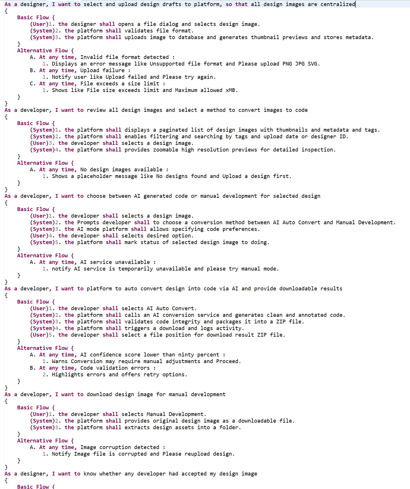
### 用例图
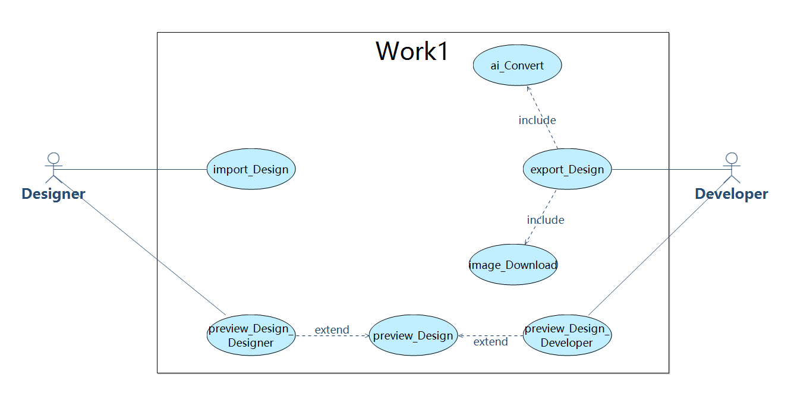
### 系统类图
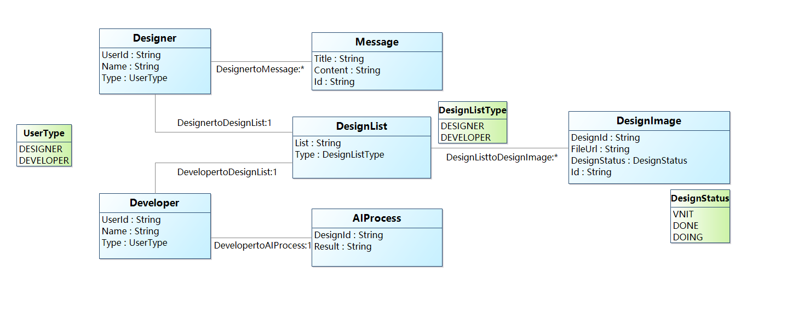
### 需求原型化截图
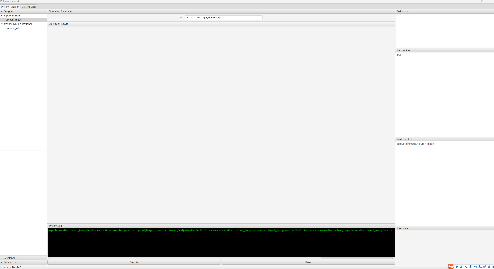

## 模型规模统计
|  指标项  |  数量  |
|  ----  | ----  |
|  自然语言需求  |  8个用户需求、15个系统需求  |
|  参与者  |  2个(设计师、开发者)  |
|  用例	 |  7个(导入、多种预览、导出等)  |
|  系统顺序图  |  7个(每个用例对应一个)  |
|  系统操作  |  9个(跨所有服务)  |
|  系统合约数量  |  8个(除共享预览外每个操作一个)  |
|  类数量 |  9个(设计师、开发者、设计图像等)  |

## 原型化成果
设计师界面截图
设计师界面
展示设计师的设计上传和预览功能

开发者界面截图
开发者界面
展示代码导出选项和开发预览功能

## 核心功能实现
### 角色专属视图

1. 设计师查看创意素材和版本

2. 开发者查看可转换代码和转换状态

# 作业2
## 架构设计自动生成
### 划分模型
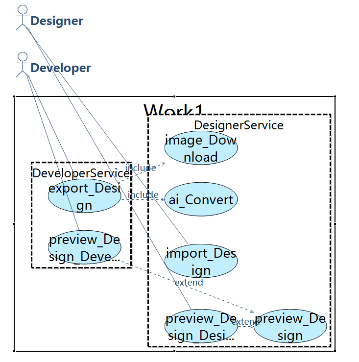
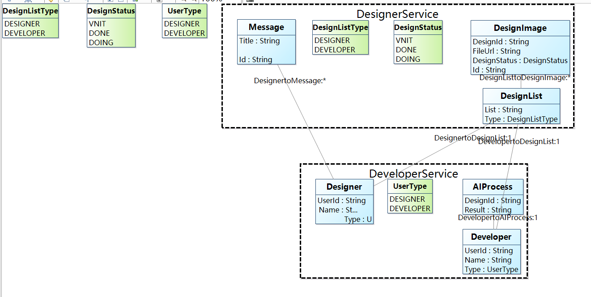
### 微服务模型
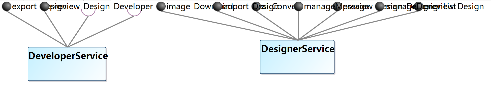
## 面向对象详细设计自动生成
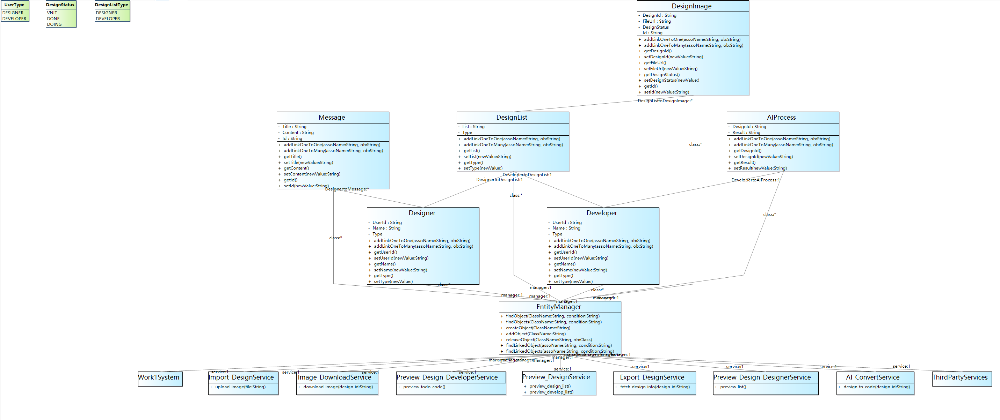
## 大模型生成设计模型与微服务拆分
### 微服务
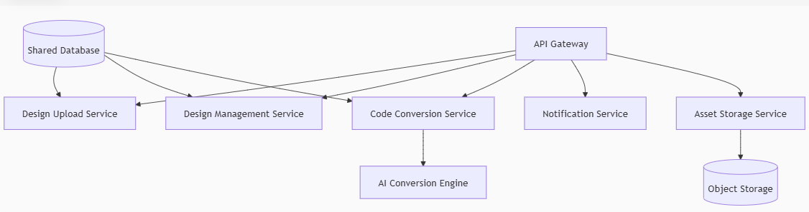
### 设计模型
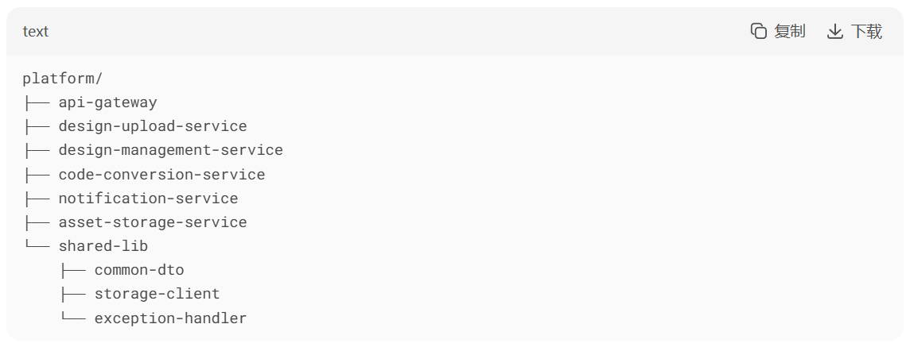

# 作业3
实验内容：使用Eclipse EMF对语言进行元模型建模方法，使用Eclipse Sirius对选定语言进行图
形建模方法，使用Eclipse Xtext对选定语言进行文本建模。
## 任务一：元模型建模过程
元模型类图
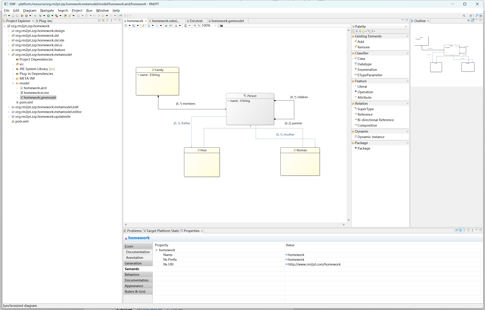
建模项目
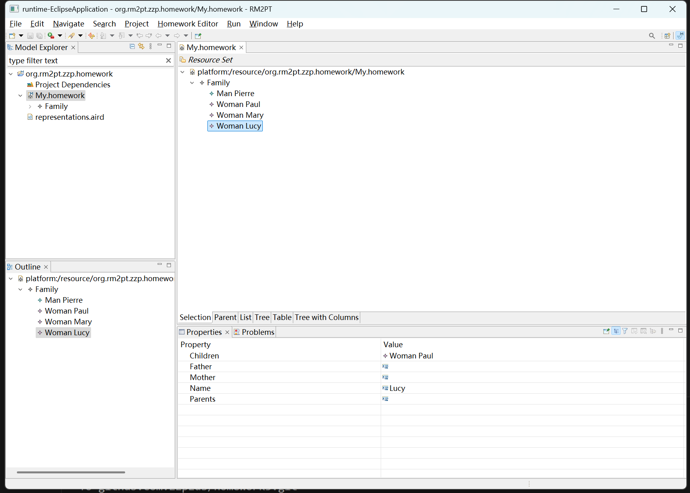
## 任务二：图形语言建模
配置icons
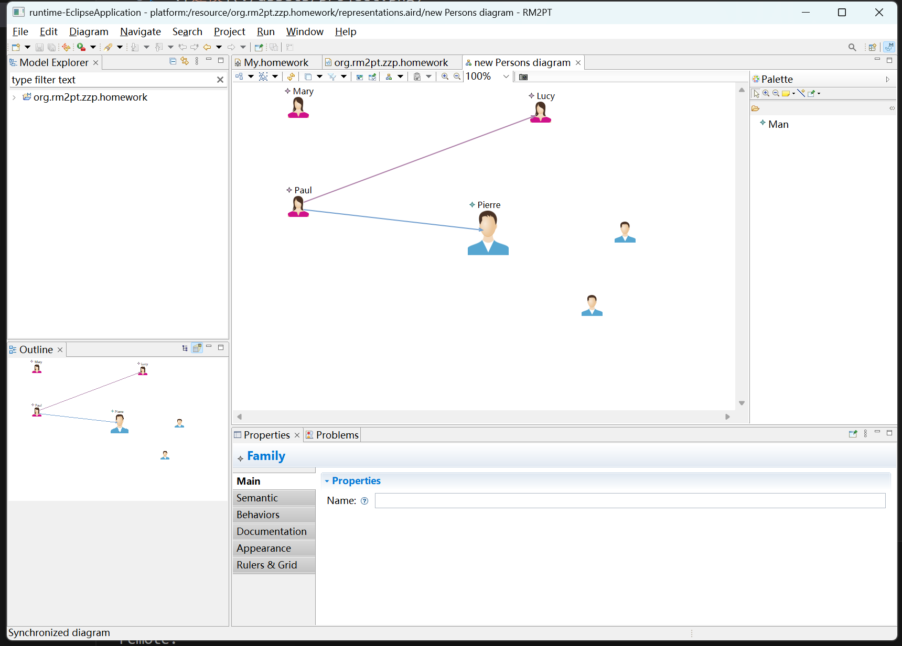
## 任务三：文本语言建模
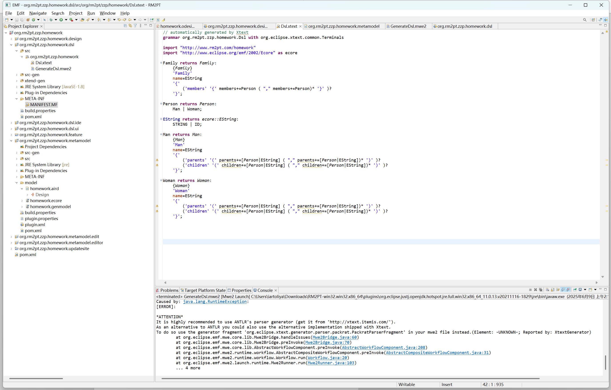
## 任务四：插件构建
打包报错
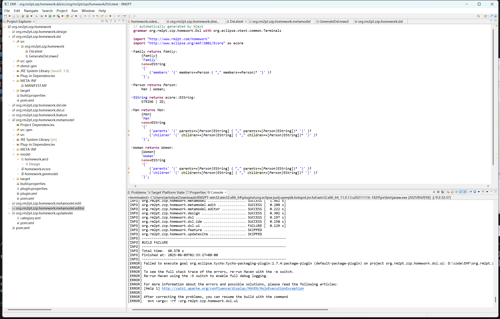

# 作业4
## 基于大语言模型的智能模型驱动 
## Agent & Prompt
### 自然语言需求识别提取
```
    你是一个需求分析专家，负责将自然语言需求转化为结构化DSL。请按以下规则处理：
    1. 识别所有用户故事（As a... I want to...）
    2. 提取每个用户故事的：
       - 参与者（Actor）
       - 基本流（Basic Flow）
       - 备选流（Alternative Flow）
    3. 使用以下JSON格式输出：
    {
      "user_stories": [{
        "title": "As a...",
        "actor": "",
        "basic_flow": [{"step": 1, "entity": "User/System", "action": ""}],
        "alternative_flows": [{
          "condition": "", 
          "steps": [{"step": "A1", "entity": "", "action": ""}]
        }]
      }]
    }
    4. 严格保持原始需求的语义完整性
```
### 用例、顺序图建模
```
    你是用例建模专家，基于结构化需求生成：
    1. 用例图（包含Actor、UseCase及其关系）
    2. 系统顺序图（包含消息序列）
    使用以下JSON格式：
    {
      "use_case_diagram": {
        "actors": ["Designer", "Developer"],
        "use_cases": ["Upload Design", "Review Designs", ...],
        "relationships": [
          {"actor": "Designer", "use_case": "Upload Design"},
          {"actor": "Developer", "use_case": "Convert Design to Code"}
        ]
      },
      "sequence_diagrams": [{
        "title": "Upload Design",
        "participants": ["Designer", "Platform"],
        "steps": [
          {"seq": 1, "from": "Designer", "to": "Platform", "message": "opens file dialog"},
          {"seq": 2, "from": "Platform", "to": "Platform", "message": "validates format"}
        ],
        "alt_flows": [
          {"condition": "Invalid format", "steps": [...]}
        ]
      }]
    }
```
### 类图建模
```
    你是类建模专家，生成：
    1. 概念类图（类、属性、关联关系）
    2. OCL合约（前置/后置条件）
    使用JSON格式：
    {
      "class_diagram": [
        {
          "name": "DesignImage",
          "attributes": [
            {"name": "id", "type": "UUID"},
            {"name": "format", "type": "string"}
          ],
          "methods": [
            {"name": "validate_format", "parameters": []}
          ]
        }
      ],
      "ocl_contracts": [
        {
          "context": "DesignImage::upload()",
          "preconditions": ["self.size <= MAX_SIZE"],
          "postconditions": ["Platform.designs.includes(self)"]
        }
      ]
    }
```
## MultiAgent
1. 自然语言需求识别提取

    解析自然语言需求，输出结构化用户故事
2. 用例、顺序图建模

    生成用例图和系统顺序图建模DSL
3. 类图建模

    生成概念类图和OCL合约的DSL
    
## 输出格式定义（DSL）
### 用例图DSL
```
{
  "use_case_diagram": {
    "actors": ["Designer", "Developer"],
    "use_cases": [
      "Upload Design Draft",
      "Review Design Images",
      "Convert Design to Code",
      "Download Code/Image",
      "Notify Acceptance"
    ],
    "relationships": [
      {
        "actor": "Designer",
        "use_case": "Upload Design Draft",
        "type": "initiate"
      },
      {
        "actor": "Developer",
        "use_case": "Review Design Images",
        "type": "initiate"
      },
      {
        "actor": "Developer",
        "use_case": "Convert Design to Code",
        "type": "initiate"
      },
      {
        "use_case": "Upload Design Draft",
        "extends": "Handle Invalid Format",
        "condition": "invalid_format"
      },
      {
        "use_case": "Upload Design Draft",
        "extends": "Handle Upload Failure",
        "condition": "upload_failure"
      },
      {
        "use_case": "Convert Design to Code",
        "includes": "AI Auto Convert",
        "condition": "ai_selected"
      }
    ]
  }
}
```
### 系统顺序图DSL
```
{
  "sequence_diagrams": [
    {
      "title": "Upload Design Draft",
      "participants": ["Designer", "Platform", "Database"],
      "steps": [
        {
          "seq": 1,
          "from": "Designer",
          "to": "Platform",
          "message": "opens file dialog and selects image"
        },
        {
          "seq": 2,
          "from": "Platform",
          "to": "Platform",
          "message": "validates file format"
        },
        {
          "seq": 3,
          "from": "Platform",
          "to": "Database",
          "message": "uploads image and stores metadata"
        },
        {
          "seq": 4,
          "from": "Platform",
          "to": "Platform",
          "message": "generates thumbnail preview"
        }
      ],
      "alt_flows": [
        {
          "condition": "Invalid file format",
          "steps": [
            {
              "seq": "A1",
              "from": "Platform",
              "to": "Designer",
              "message": "Displays error: Unsupported file format"
            }
          ]
        },
        {
          "condition": "File size exceeds limit",
          "steps": [
            {
              "seq": "C1",
              "from": "Platform",
              "to": "Designer",
              "message": "Shows: File size exceeds limit"
            }
          ]
        }
      ]
    }
  ]
}
```
### 类图DSL
```
{
  "class_diagram": [
    {
      "name": "DesignImage",
      "attributes": [
        {"name": "id", "type": "UUID"},
        {"name": "format", "type": "enum{PNG,JPG,SVG}"},
        {"name": "size", "type": "float"},
        {"name": "upload_date", "type": "DateTime"},
        {"name": "thumbnail", "type": "Blob"},
        {"name": "status", "type": "enum{PENDING,DOING,COMPLETED}"}
      ],
      "methods": [
        {"name": "validate_format", "parameters": []},
        {"name": "generate_thumbnail", "parameters": []},
        {"name": "store_metadata", "parameters": ["metadata: dict"]}
      ]
    },
    {
      "name": "Designer",
      "attributes": [
        {"name": "designer_id", "type": "string"},
        {"name": "name", "type": "string"}
      ],
      "methods": [
        {"name": "upload_design", "parameters": ["image: DesignImage"]}
      ]
    },
    {
      "name": "Developer",
      "attributes": [
        {"name": "developer_id", "type": "string"},
        {"name": "preferred_language", "type": "string"}
      ],
      "methods": [
        {"name": "select_conversion_method", "parameters": ["method: enum{AI,MANUAL}"]},
        {"name": "download_result", "parameters": ["output: OutputPackage"]}
      ]
    }
  ],
  "relationships": [
    {
      "source": "Designer",
      "target": "DesignImage",
      "type": "1-to-many",
      "label": "uploads"
    },
    {
      "source": "Developer",
      "target": "DesignImage",
      "type": "many-to-many",
      "label": "processes"
    },
    {
      "source": "Platform",
      "target": "DesignImage",
      "type": "composition",
      "label": "manages"
    }
  ]
}
```
## 工具定义 Tools
### 外部AI D2C服务
```
    调用AI设计图转样式代码服务，节省开发人力
    参数:
        design_image_id: 设计图的唯一标识
        preferences: 开发者的代码偏好设置
    返回:
        {
            "status": "success" | "error",
            "code": "生成的代码字符串",
            "confidence_score": 0.0-1.0,
            "warnings": [""]
        }
```
### 用户通知服务
```
    向指定用户发送通知，告知设计图接收和开发进度
    参数:
        user_id: 用户ID
        message: 通知内容
        notification_type: 通知类型 (info/success/warning/error)
    返回:
        发送是否成功
```